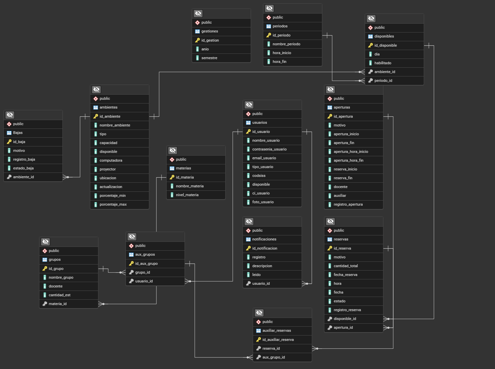
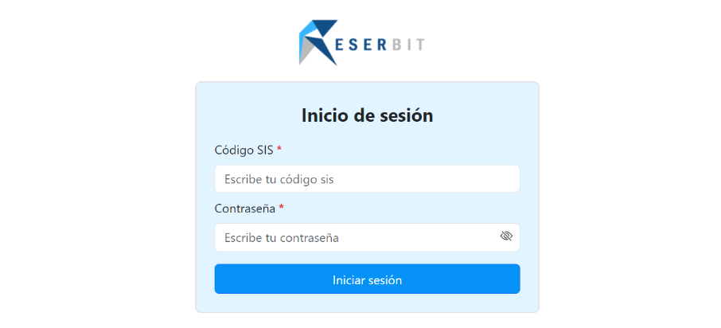

# 📚 Backend - Reserbit (Reserva de Ambientes Universitarios)

Este proyecto es el backend de **Reserbit**, un sistema web diseñado para facilitar la **reserva de ambientes universitarios**, ya sea para **exámenes, clases especiales o eventos institucionales**, dentro del periodo de reservas definido por la universidad.
El sistema gestiona ambientes, usuarios, grupos, materias y notificaciones, automatizando el proceso de reserva y disponibilidad de espacios educativos.

## 📦 Contenido del API

Este backend expone las siguientes rutas mediante Express:

- `/api/ambientes` → Gestión de ambientes físicos
- `/api/usuarios` → Gestión de usuarios del sistema
- `/api/gestiones` → Gestión de periodos académicos
- `/api/materias` → Gestión de materias
- `/api/periodos` → Administración de periodos de clase
- `/api/grupos` → Gestión de grupos por materia
- `/api/disponibles` → Control de disponibilidad de ambientes
- `/api/aperturas` → Definición de fechas de apertura de reservas
- `/api/reservas` → Gestion de reservas de ambientes
- `/api/notificaciones` →Notificaciones a usuarios sobre su reserva

El servidor corre en el puerto:

```
http://localhost:4000/
```

## 🧰 Tecnologías utilizadas

- **Node.js**
- **Express**
- **Sequelize** (ORM para PostgreSQL)
- **PostgreSQL**
- **dotenv**
- **moment-timezone**
- **CORS**
- **Morgan**
- **UUID**
- **XLSX** (para exportación/importación de datos)

## ▶️ Instalación y ejecución

1. Clona el repositorio y entra a la carpeta del backend.
2. Instala las dependencias:

```bash
npm install
```

4. Crea una base de datos en PostgreSQL
5. Crea un archivo `.env` con las variables necesarias como `URL_DATABASE`.
6. Sincroniza la base de datos con Sequelize
> Esto se encargará de sincronizar todos los modelos con la base de datos usando Sequelize
```bash
npm run syncdb
```
8. Inicia el servidor:

```bash
npm run start
```

> El servidor escuchará en el puerto definido (por defecto `4000`).

## 🗄️ Diagrama de la base de datos

Aquí se visualiza el esquema general utilizado en MongoDB para la gestión de datos:



## 📸 Vista inicial frontend

Aquí se visualiza el login para el ingreso al sistema `Reserbit`, al cual le proveemos los servicios necesarios desde el backend para el correcto funcionamiento de sus funcionalidades principales.


